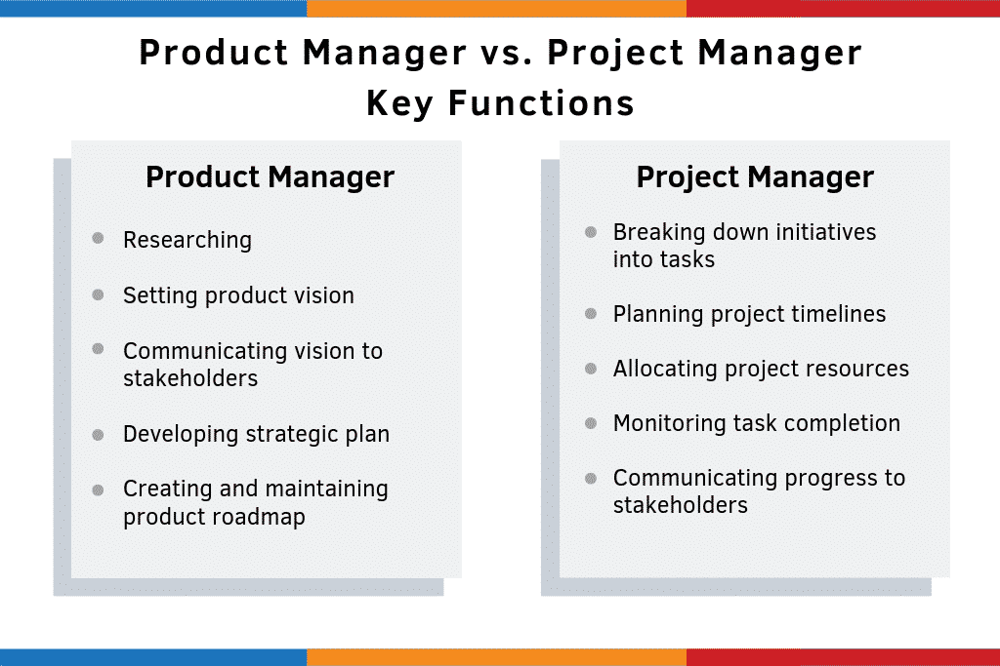
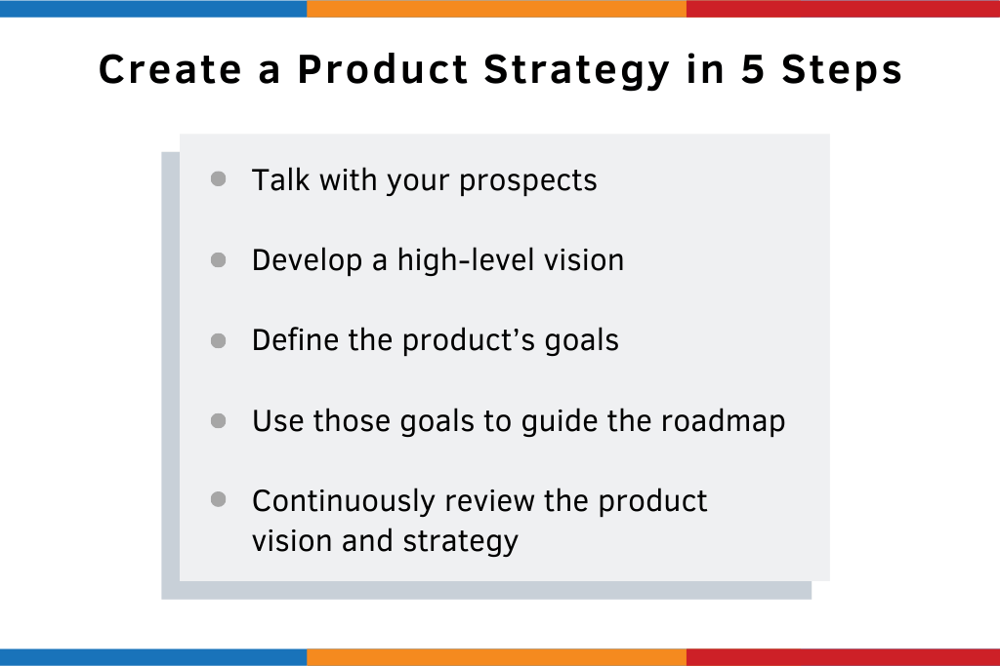
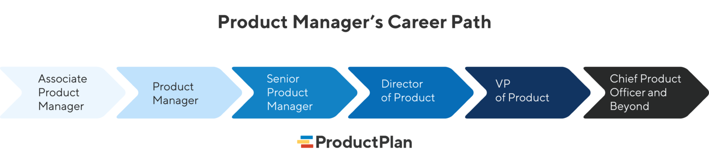
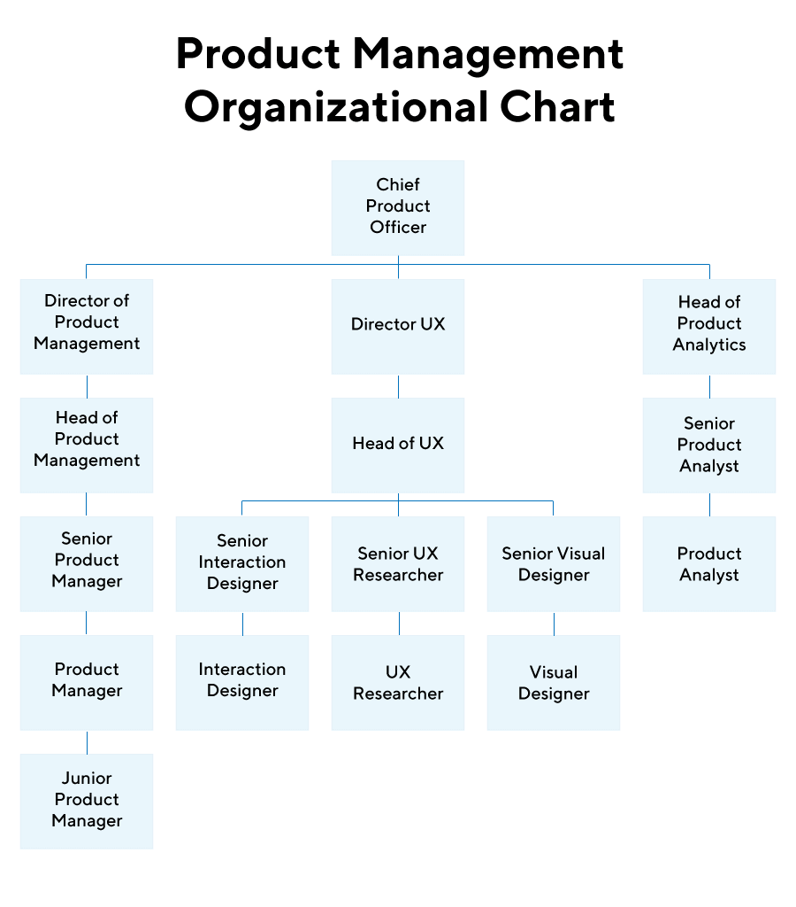
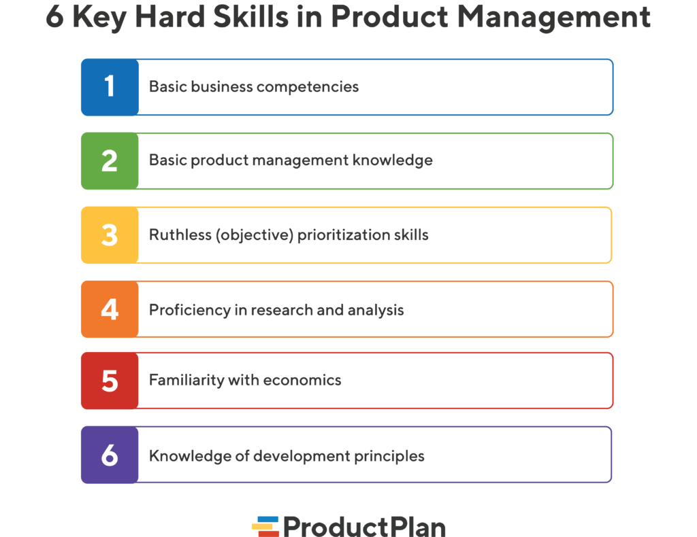

# Awesome Product Management 

This Awesome list about [Product Management](https://en.wikipedia.org/wiki/Product_management)  interesting and useful topics.   

## Table of Contents
1. [Introduction](#Introductions)
2. [What is product management?](#What-is-product-management)
3. [Product Manager vs Project Manager](#Product-Manager-vs-Project-Manager)
4. [Product management’s strategic function](#Product-management’s-strategic-function)
5. [Product Management Jobs](#Product-Management-Jobs)
6. [Agile product managers](#Agile-product-managers)
7. [The Product Executive Track](#The-Product-Executive-Track)
8. [What are the Most Important Product Management Skills?](#What-are-the-Most-Important-Product-Management-Skills?)
9. [Common](#Common)

## Inroduction
The question, “What is product management?” comes up pretty often, even from experienced business people. One reason is that product management encompasses a wide-ranging area of responsibilities. Indeed, the role itself means very different things in different organizations.

Here is the most concise response we’ve come up with for the “What is product management?” question: Product management is the practice of strategically driving the development, market launch, and continual support and improvement of a company’s products.

Of course, that is an abstract explanation of the role. So what is product management? What does the job entail?

## What is product management?
The day-to-day tasks include a wide variety of strategic and tactical duties. Most product managers or product owners do not take on all these responsibilities. At least some of them are owned by other teams or departments in most companies. 

But most product professionals spend the majority of their time focused on the following:

### - Conducting Research: 
Researching to gain expertise about the company’s market, user personas, and competitors.
### - Developing Strategy: 
Shaping the industry knowledge they’ve learned into a high-level strategic plan for their product—including goals and objectives, a broad-strokes overview of the product itself, and maybe a rough timeline.
### - Communicating Plans: 
Developing a working strategic plan using a product roadmap and presenting it to key stakeholders across their organization: executives, investors, development teams, etc. Ongoing communication across their cross-functional teams throughout the development process and beyond.
### - Coordinating Development: 
Assuming they have received a green light to move forward with their product’s strategic plan, coordinate with the relevant teams—product marketing, development, etc.—to begin executing the plan.
### - Acting on Feedback and Data Analysis: 
Finally, after building, testing, and introducing the product to the marketplace, learning via data analysis and soliciting direct feedback from users, what works, what doesn’t, and what to add. Working with the relevant teams to incorporate this feedback into future product iterations.

## Product Manager vs Project Manager

## Product management’s strategic function
Product management is a strategic function. Tasking product managers with determining a product’s overall reason for being—the product’s “Why?” 

They’re also responsible for communicating product objectives and plans for the rest of the company. They must ensure everyone is working toward a shared organizational goal. 

Product management encompasses a broad set of ongoing strategic responsibilities. They shouldn’t be responsible for the ground-level details of the development process.

Innovative organizations separate this function and assign tactical elements to project managers, such as scheduling and managing workloads. This distinct division leaves the product manager free to focus on the higher-level strategy.

## Product Management Jobs
The ideal product management job is—unsurprisingly—being a product manager. A product manager will usually own one or more products or a horizontal function across multiple products, such as “user experience” or “e-commerce.” 

Associate product managers and junior product managers are typically new to the domain and have more limited responsibilities. A senior product manager will have a little more seasoning and a broader scope of their role. But these are essentially slightly different flavors of your basic product manager.

Technical product managers are another critical variation of the role. These individuals are often transitioning from a role in the engineering or IT teams and tasked with managing aspects of one or more products requiring a deeper understanding of technical issues, such as infrastructure and APIs.

## Agile product managers
In an Agile organization, product owners also may be part of the puzzle. While there’s some debate, product owners are often considered part of product management. However, they are distinct from product managers. A product owner is embedded in one or more scrum teams, but their focus is mainly tactical, helping ensure the strategy laid out by product managers is appropriately executed. 

As one moves up through the ranks, more senior product management roles have more significant distinctions. For example, a product line manager will own multiple products that are typically related to each other, sometimes overseeing individual contributor product managers that manage a single product or sub-component.

## The Product Executive Track
The executive track begins with Director and Senior Director roles. Depending on the company’s size, this may be a loftier title for a “lone wolf” product management professional. But, on the other hand, it may indicate an even broader portfolio of products and the corresponding direct reports to support that. 

Vice President and Senior Vice President are similar escalations up the corporate ladder. Those holding these jobs may see more diversity on their staff as they may also end up owning business analysts, UX, product marketing, or other related functions. The apex of a product management career is Chief Product Officer. Although not as common, this increasingly seen role elevates product management to the C-suite. It gives the product the same political weight as Engineering or Marketing, which often indicates an organization is committed to product-led growth. A CPO is typically supported by a larger team and provides directional guidance and coaching rather than diving into the nitty-gritty details of particular products.

## What are the Most Important Product Management Skills?
With a shared understanding of product management’s scope, we can dig into what it takes to be a product manager. Product managers find their way by following the paths of those who came before them. And those more experienced in the profession have plenty of lessons to offer their peers and newcomers. 

You can’t get a degree in product management. There’s no single career path to get there. It’s more about the skills required to do the job well than a particular pedigree. Here are some of the key hard skills in product management.

## Common
1. [Startup School](https://www.startupschool.org/)
1. [Product Manager HQ](https://www.productmanagerhq.com/)
1. [Resources For New PMs](https://miketadlock.tumblr.com/post/44814775687/resources-for-new-pms)
1. [How to create a product roadmap: step-by-step guide and free template for founders](https://krit.com/blog/product-roadmap-free-template-and-guide-for-founders)
1. [Product Feature UX plan](https://paper.dropbox.com/published/Product-Feature-UX-plan-aTB1elcLy3DC8NwAc33S3Dp)
  

License
----

MIT
